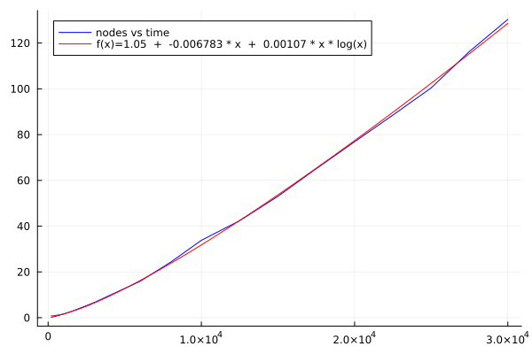

```@meta
CurrentModule = HighVoronoi
```

# HighVoronoi: $N\log N$ complexity Voronoi Grids in $\mathbb{R}^d$

Documentation for [HighVoronoi](https://github.com/martinheida/HighVoronoi.jl). Voronoi mesh generation in arbitrary dimensions + Finite Volume setup, also for vertices with $d+k$, $k>1$ generators.

- [QUICK START on VORONOI generation: Click here](@ref quickVG) / [The ABSTRACT WORKFLOW is here](@ref workflowgeometry) 
- [QUICK START on FINITE VOLUME methods: Click here](@ref QuickFV) / [The ABSTRACT WORKFLOW is here](@ref workflowfv)  
- [Toy file for testing numerical solver](@ref toyfile)

There is a recent [PREPRINT](http://www.wias-berlin.de/preprint/3041/wias_preprints_3041.pdf) where I outline the algorithm and provide a mathematical proof that it works. 

## Index
```@index
```

## Functionality of the HighVoronoi Package

`HighVoronoi` is intended as an effective Voronoi mesh generator in any ARBITRARY DIMENSION greater or equal to 2. It can work on polygonal domains and also on (partially or fully) periodic domains. It also provides methods to implement Finite Volume problems on these high dimensional meshes.

The underlying Raycast-Method as well as the Monte-Carlo integration method were reimplemented from the `VoronoiGraph` package by Alexander Sikorski in the version of June 2022. In the course, the code was fully restructured and in wide parts rewritten to adapt it to mesh-refinement and to verteces that are formed by more than $d+1$ cells, e.g. cubic grids (with $2^d$ cells generating each vertex). Furthermore, boundaries, periodic grids and internal correction algorithms are implemented to stabilize the algorithm and to increase numerical accuracy.

## Performance and advantages over the classical algorithms

The classical approach is to use quickhull in $d+1$ dimensions to get the Delaunay grid and calculate the Voronoigrid from there. Starting with $n$ nodes that will have $K$ verteces in total, the amount of calculations is at leas $n^2$ for the quickhull algorithm (with a lot of linear equations to be solved) and afterwards solving of $K$ linear equations. In general, it is not fully understood how Quickhull scales with time, but it seems to be polynomial, see [http://www.qhull.org/html/qh-code.htm#performance](http://www.qhull.org/html/qh-code.htm#performance)

Compared to that, the computational cost of the `HighVoronoi` algorithm scales with $K*\ln n$ on regular grids and comes with almost no linear equations to be solved, except for the few occasions (like 0.01%) when a vertex needs to be corrected to compensate for accumulated machine inaccuracy. A paper on the underlying Raycast-Algorithm is in preparation.

### Performance in 4D


### Performance in 5D


### Code for performance check
To verify the claimed scaling, one may use the following:
```julia
 nodeslist = [200,500,1000,1500,2000,3000,4000,6000,8000,10000,12500,15000,17500,20000,22500,25000,27500,30000]
 dim = 5
 # look up statistics.jl in the src/ folder to see how collect_statistics and statistic_samples work 
 A = HighVoronoi.collect_statistics(HighVoronoi.statistic_samples(dim,nodeslist,4),txt="results$(dim)D-30000-new.txt")
```

 The above calculates for each number of nodes `n` in `nodeslist` in dimension `dim` 
  a Voronoi grid in the unit cube. It does this 4 times and returns averaged information about:
- `A[1,entry]` = number of nodes
- `A[2,entry]` = `dim`
- `A[3,entry]` = average time for one calculation
- `A[4,entry]` = number of vertices
- `A[5,entry]` = number of vertices at the boundary of the unit cube
- `A[6,entry]` = number of raycasts
- `A[7,entry]` = average number of nn-searches per raycast
 
The code below plots sample results from a 4D or a 5D simulation:
 
```julia
 # 4D: 
 A = [200.0 500.0 1000.0 1500.0 2000.0 3000.0 4000.0 6000.0 8000.0 10000.0 12500.0 15000.0 17500.0 20000.0 22500.0 25000.0 27500.0 30000.0; 4.0 4.0 4.0 4.0 4.0 4.0 4.0 4.0 4.0 4.0 4.0 4.0 4.0 4.0 4.0 4.0 4.0 4.0; 0.050457975 0.131645475 0.295149075 0.47852225 0.6634493 1.166146925 1.5823699 2.430149 3.32245565 4.32058905 5.644007625 6.986462575 8.052074575 9.1541459 10.400109675 11.842956775 12.998982725 14.368660125; 4026.0 11125.5 23466.5 36429.5 49401.0 76030.0 103180.0 158009.5 213505.0 268840.75 339912.0 411174.0 482256.0 553107.5 625884.5 697474.5 769424.0 841395.0; 1633.75 3630.25 6507.25 9074.5 11473.75 15744.0 20051.75 27695.25 34437.25 41655.25 49458.0 56950.75 64301.75 71822.25 78083.25 85112.25 91864.0 98515.75; 4017.75 11104.25 23427.0 36371.25 49328.0 75921.5 103041.5 157807.75 213230.5 268510.5 339506.0 410691.0 481688.0 552451.5 625152.0 696653.25 768551.25 840449.0; 2.611411859871819 2.6134813247180135 2.605658001451317 2.6184486373165616 2.6229018001946156 2.6242599263713178 2.6269051789812843 2.621926046090892 2.626835748169235 2.627970786989708 2.628140592507938 2.6301477266363276 2.631068762352394 2.6324491833219748 2.6321470618345617 2.633201309259664 2.6337345752804384 2.6314196340289535]
 
 # 5D: 
 #A = [200.0 500.0 1000.0 1500.0 2000.0 3000.0 4000.0 6000.0 8000.0 10000.0 12500.0 15000.0 17500.0 20000.0 22500.0 25000.0 27500.0 30000.0; 5.0 5.0 5.0 5.0 5.0 5.0 5.0 5.0 5.0 5.0 5.0 5.0 5.0 5.0 5.0 5.0 5.0 5.0; 0.211763325 0.653174575 1.577807425 2.689303325 3.98041055 6.6097507 9.7188122 15.90510205 24.3054906 33.8117523 42.40471245 53.050212825 65.127449625 76.881652375 88.523779375 100.420322575 116.35595995 130.32798235; 15143.0 43881.0 98554.25 157179.25 215857.75 340909.25 468655.0 730134.0 1.0014475e6 1.2742545e6 1.6244175e6 1.97465225e6 2.324588e6 2.68794375e6 3.04505275e6 3.40743625e6 3.776617e6 4.1409315e6; 7809.75 19189.75 37197.0 53944.75 70912.5 101793.5 132341.75 190513.75 244890.5 299057.25 361937.25 425335.5 487805.25 545611.75 606317.75 664678.5 720208.75 776399.25; 15137.0 43869.75 98534.0 157151.0 215819.75 340856.5 468575.5 730022.75 1.00130575e6 1.27407825e6 1.6242075e6 1.97439425e6 2.32430825e6 2.68760575e6 3.0446865e6 3.40703625e6 3.77616375e6 4.140452e6; 2.5825130474995044 2.5891018298485857 2.593754440091745 2.598367175519087 2.6079552496933203 2.608840523798138 2.6137458104403666 2.6110275330460593 2.612983846342638 2.6159984679119983 2.6151359970939674 2.617593851886471 2.6170647761543675 2.616155661967906 2.6180548473545633 2.6180065592199084 2.6191039782106906 2.619351220591375]

# This can be plotted using the following
using Plots
using DataFitting
using SpecialFunctions

output_round(x) = round(x, digits = 3 - floor(Int64,log10(abs(x))))

f(x, p1, p2, p3 ) = @. (p1  +  p2 * x  +  p3 * x * log(x)   )

params = [1.0,1.0,1.0]

dom = Domain(A[1,:])
data = Measures(A[3,:],1.0)

model1 = Model(:comp1 => FuncWrap(f, params...))
prepare!(model1, dom, :comp1)
result1 = fit!(model1, data)

plot(A[1,:], A[3,:], color=:blue, label="nodes vs time")
my_p1 = result1.param[:comp1__p1].val
my_p2 = result1.param[:comp1__p2].val
my_p3 = result1.param[:comp1__p3].val
plot!(x->my_p1  +  my_p2 * x  +  my_p3 * x * log(x), color=:red, label="f(x)=$(output_round(my_p1))  +  $(output_round(my_p2)) * x  +  $(output_round(my_p3)) * x * log(x)")

savefig("plot.pdf")

```

## The `HighVoronoi` package provides 

- a series of data sets that allow to set up a Voronoi mesh in arbitrary dimension on a convex domain with plane boundaries or even without boundaries.
- works for nodes in general and non-general position. In particular, verices may be generated by more than $d+1$ generating nodes.
- 2 different methods to calculate the volumes and interface areas of cells: An exact triangulation method and a Montecarlo method
- 3 different methods to integrate functions:
    * two on the fly for both triangulation and Montecarlo
    * one heuristic method based on given volume and surface data
- Refinement of Voronoi tessellations: Add points to your grid and the algorithm will locally recalculate the mesh, including integration of volume, area and functions.
- Fast calculation of periodic grids using the `periodic_grid` keyword.
- Set up the linear equation for a finite volume Voronoi discretization of a given elliptic PDE with Neumann, Dirichlet or periodic boundary conditions
- other functionalities like 2D data export in Metapost, storing and loading data.

## Important data structures and methods

### Data structures
- `VoronoiGeometry`: Creating, loading, updating, refining and managing the mesh
- `VoronoiNodes`: Nodes for mesh generation
- `Boundary`: Boundary of the mesh
- `VoronoiData`: Providing the data of the mesh for further use outside of `HighVoronoi.jl`
- `VoronoiFVProblem`: Calculating internal data for setting up linear matrix equations for Finite Volume discretizations on a `VoronoiGeometry`
- `StepFunction`: Generates a piecewise constant function
- `InterfaceFunction`: Generates a function living on interfaces.
- `FunctionComposer`: Glues together several functions and returns a new vector valued function.
 
### Methods
- `write_jld`: Store a `VoronoiGeometry`
- `refine!`: refine a `VoronoiGeometry` by new nodes
- `substitute!`: refine a `VoronoiGeometry` by erasing the points in a given subdomain and replacing them by a finer precalculated grid. Automatically fills out all the gaps.
- `linearVoronoiFVProblem`: Extract the Matrix and right-hand-side from a given `VoronoiFVProblem` and for given boundary conditions.

### To be implemented in a forthcoming version
- refine a `VoronoiFVProblem`. Project a given "rough" FV solution of a `linearVoronoiFVProblem` onto the refined solution space. 
- a projection operator that allows to project piecewise constant functions from one Voronoi diagram onto another with no loss of mass.
- improving nearest neighbor search fitted to spacial distribution of points.
