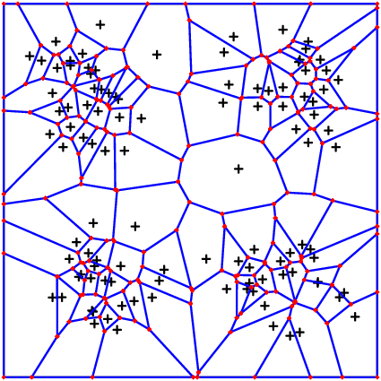

# Voronoi: Nodes and Geometry, Integrators

## [Nodes](@id differentnodegenerators)
The most basic thing is the creation of a list of Points. We advise to use the following:

```@docs
VoronoiNodes(x::Matrix)
```
An advanced method is given by the following
```julia
VoronoiNodes(number_of_nodes::Int;density , 
            domain::Boundary=Boundary(), bounding_box::Boundary=Boundary(),
            criterium=x->true)
```
When `density = x->f(x)` this will create a cloud of approximately `number_of_nodes` points inside the intersection of `domain` and `bounding_box` with spatial distribution $f(x)$. Note that both exact number and position of points are random.  The variable `bounding_box` allows to handle also the case when `domain` is unbounded. The intersection of `domain` and `bounding_box`  HAS TO BE bounded!

The following two pictures show first a distribution `density = x->sin(pi*2*x[1])^2*sin(pi*2*x[2])^2` and the second takes the same density squared.




### Single Nodes

To instatiate a single node (e.g. if you want to add a specific node to an existing list of nodes) use

```julia
# make [1.0, 0.0, 0.5] a valid Voronoi node
VoronoiNode([1.0, 0.0, 0.5])
```

### Example

```julia
# This is an example to illustrate VoronoiNodes(number_of_nodes::Int;density)

## First some plot routine ############################
using Plots

function plot_2d_surface(nodes, values)
    # The following two lines are necessary in order for the plot to look nicely
    func = StepFunction(nodes,values)
    new_nodes = vcat([VoronoiNode([k/10,j*1.0]) for k in 0:10, j in 0:1], [VoronoiNode([j*1.0,k/10]) for k in 1:9, j in 0:1])
    append!(nodes,new_nodes)
    append!(values,[func(n) for n in new_nodes])
    
    x = [node[1] for node in nodes]
    y = [node[2] for node in nodes]
    
    p = Plots.surface(x, y, values, legend=false)
    xlabel!("X")
    ylabel!("Y")
    zlabel!("Values")
    title!("2D Surface Graph")
    
    display(p)
end
########################################################

## Now for the main part ################################

my_distribution = x->(sin(x[1]*π)*sin(x[2]*π))^4
my_nodes = VoronoiNodes(100,density = my_distribution, domain=cuboid(2,periodic=[]))
# you may compare the output to the following:
# my_nodes = VoronoiNodes(100,density = x->1.0, domain=cuboid(2,periodic=[]))
println("This generated $(length(my_nodes)) nodes.")
my_vals = map(x->sin(x[1]*π)^2*sin(x[2]*π),my_nodes)
plot_2d_surface(my_nodes,my_vals)
```

### DensityRange

```@docs
DensityRange{S}
```

## Geometry
The creation and storage of Voronoi geometry data is handled by the following class. 

```@docs
VoronoiGeometry{T}
```

To create a Voronoi mesh it is most convenient to call either of the following methods

```@docs
VoronoiGeometry()
```

## [Integrators (overview)](@id integratoroverview)

As discussed above there is a variety of integrators available to the user, plus some internal integrators that we will not discuss in this manual. The important integrators for the user are:

* `VI_GEOMETRY`: Only the basic properties of the mesh are provided: the verteces and an implicit list of neighbors of each node. This is the fastes way to generate a `VoronoiGeometry`
* `VI_MONTECARLO`: Volumes, interface areas and integrals are calculated using a montecarlo algorithm introduced by A. Sikorski in `VoronoiGraph.jl` and discussed in a forthcoming article by Heida, Sikorski, Weber. This particular integrator comes up with the following additional paramters:
    + `mc_accurate=(int1,int2,int3)`: Montecarlo integration takes place in `int1` directions, over `int2` 
            volumetric samples (vor volume integrals only). It reuses the same set of directions `int3`-times to save memory allocation time.
            Standard setting is: `(1000,100,20)`.
* `VI_POLYGON`: We use the polygon structure of the mesh to calculate the exact values of interface area and volume. The 
        integral over functions is calculated using the values at the center, the verteces and linear interpolation between. Also this method is to be discussed in the anounced article by Heida, Sikorski, Weber.  
* `VI_HEURISTIC`: When this integrator is chosen, you need to provide a fully computed Geometry including volumes and interface areas.
        `VI_HEURISTIC` will then use this information to derive the integral values.
* `VI_HEURISTIC_MC`: This combines directly `VI_MONTECARLO` calculations of volumes and interfaces and calculates integral values 
        of functions based on those volumes and areas. In particular, it also relies on `mc_accurate`!

It is important to have in mind that the polygon-integrator will be faster in low dimensions, whereas the Montecarlo integrator will outperform from 5 dimensions and higher. However, when volumes and integrals are to be calculated in high dimensions, the `VI_HEURISTIC_MC` is highly recommended, as it works with much less function evaluations than the `VI_MONTECARLO`. 

## Storage

```@docs
write_jld()
```

```@docs
load_Voronoi_info()
```

## Extraction of `VoronoiData` data for further processing

```@docs
VoronoiData
```

